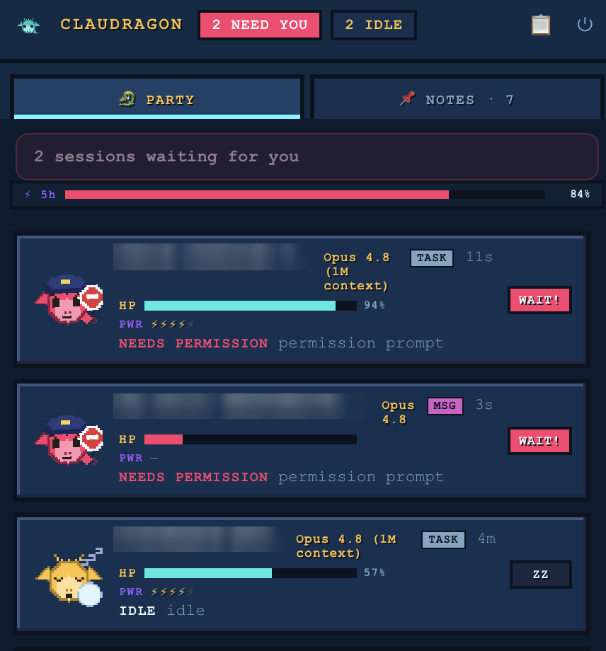

# 🐉 Claudragon

> 🟡 **Alpha · `v0.1.0-alpha.7`** — early preview. macOS-tested; cross-platform code present but unverified. Expect rough edges.

> A cross-platform tray control panel for the fleet of [Claude Code](https://claude.com/claude-code) sessions running across your terminals.



<sub>The **Pixel** view — session names blurred. A compact **Classic** board is also available (toggle with 🎮).</sub>

When you run several Claude Code instances at once it's easy to lose track of which one is
still working, which finished, and — most annoyingly — **which one is blocked waiting for
your permission**. Claudragon puts them all in one menubar/tray panel so you can see, at a
glance, where each session is and jump straight to the one that needs you.

```
🐻 CLAUDRAGON                     🔴 2 need you · 🟢 2 running
────────────────────────────────────────────────────────────
🔴  api-server        NEEDS PERMISSION  permission prompt   24s →
🔴  web-frontend      NEEDS PERMISSION  permission prompt    2m →
🟢  auth-service      RUNNING           busy                 1m →
🟢  worker            RUNNING           busy                 7m →
🟡  billing-api       IDLE              idle                22h →
────────────────────────────────────────────────────────────
            click a card → jump to its terminal
```

## Why

There are great tools for Claude Code **usage/cost** (ccusage) and **OpenTelemetry → Grafana**
dashboards. What's missing is a simple, live **status board** that reliably shows the one thing
that interrupts your flow: *a session is paused, waiting for you to approve a tool.* Claudragon focuses on that — live status, permission-waiting first, one-click jump.

## How it works

Claude Code writes a small JSON file per running session at `~/.claude/sessions/<pid>.json`:

```jsonc
{ "pid": 47214, "sessionId": "0a0a…", "cwd": "/path/to/project",
  "status": "waiting", "waitingFor": "permission prompt", "updatedAt": 1782… }
```

Claudragon polls those files (every 1.5s) and derives a state per session. The
permission-waiting signal is a **first-class field** (`status: "waiting"`,
`waitingFor: "permission prompt"`), so detection is reliable — not guessed from logs.

| `status` | `waitingFor` | Board state |
| --- | --- | --- |
| `waiting` | `permission prompt` | 🔴 **NEEDS PERMISSION** |
| `waiting` | (other) | 🟠 WAITING |
| `busy` | – | 🟢 RUNNING |
| `idle` | – | 🟡 IDLE |
| (process gone) | – | ✅ DONE |
| _(ExitPlanMode prompt — needs the optional hook)_ | | 🟣 **APPROVE PLAN** |

With the optional integration enabled (below), Claudragon also splits out **🟣 APPROVE PLAN** —
a session paused on an `ExitPlanMode` plan-approval prompt, which otherwise looks identical to a
tool-permission prompt.

The architecture is a small **core module** (`src/core`) that reads files and produces one
`fleet` snapshot, and a **thin UI** (Electron tray + popover renderer) that just renders it.
The UI never touches the filesystem. You can run the core with no GUI at all:

```bash
npm run scan          # pretty table of the current fleet
npm run scan:json     # the full fleet snapshot as JSON
```

## Requirements

- Runs on **macOS, Linux, and Windows** (it only reads `~/.claude`, which Claude Code uses on
  every platform; honors `CLAUDE_CONFIG_DIR` if you've moved it).
- The prebuilt app **needs no Node.js** — Electron is bundled. Node.js ≥ 18 is only needed to
  run from source.

## Download & install

Grab the installer for your OS from the
[**Releases**](https://github.com/oguz-demir-insider/claudragon/releases) page:

| OS | Download | Install |
| --- | --- | --- |
| **macOS** | `Claudragon-<version>-arm64.dmg` (Apple Silicon) or `-x64.dmg` (Intel) | Open the `.dmg`, drag **Claudragon** to Applications. |
| **Windows** | `Claudragon-Setup-<version>.exe` | Run the installer. |
| **Linux** | `Claudragon-<version>.AppImage` or the `.deb` | `chmod +x` the AppImage and run it, or `sudo dpkg -i` the `.deb`. |

Claudragon lives in your **menubar/tray** (no dock/taskbar icon) and color-codes the fleet:
🔴 red = someone needs permission, 🟢 green = something running, ⚪ grey = idle/empty. Click the
tray icon to open the board.

> **Unsigned builds (alpha).** The installers aren't code-signed yet, so your OS will warn about
> an "unidentified developer." This is expected — the app is 100% local and open source:
> - **macOS:** right-click **Claudragon.app → Open**, then **Open** in the dialog (once). Or run
>   `xattr -dr com.apple.quarantine /Applications/Claudragon.app`.
> - **Windows:** on the SmartScreen prompt, click **More info → Run anyway**.

## Run from source (development)

```bash
git clone https://github.com/oguz-demir-insider/claudragon.git
cd claudragon
npm install
npm start
```

> Icon assets are committed, so `npm install && npm start` is all you need. To regenerate them:
> `npm run icons`. To build installers locally: `npm run dist` (outputs to `dist/`; builds for
> your current OS).

## Jump to terminal

Click any card to focus the terminal that owns that session. This is **best-effort and
OS-specific**:

- **macOS** — focuses the matching **iTerm2** or **Terminal.app** tab by its TTY.
- **Other terminals / Linux / Windows** — falls back to copying a
  `claude --resume <session-id>` command to your clipboard so you can re-attach.

The board works as a pure monitor everywhere; the jump is a convenience on top.

## Optional: real stats & plan detection

Polling alone drives the whole board. Turn on the optional integration to unlock **real
per-session stats** and the **🟣 APPROVE PLAN** state:

- **Right-click the tray icon → _Enable rich stats & plan detection_.** (Or from source:
  `npm run install-hooks`.)

What it adds, all from Claude Code's own data:

- **HP = context remaining** — the bar drains as a session fills its context window and flashes
  red near auto-compact, so you can see which session is about to compact at a glance.
- **Power ⚡ = reasoning effort** (low → max), **Level = the model** (e.g. `Opus 4.8`), plus
  cost and lines changed.
- A shared **⚡ 5h** "mana" bar — your account-wide 5-hour rate-limit usage.
- **🟣 APPROVE PLAN** — a dedicated state (purple dragon, gold `?`, its own chime) for a session
  paused on an `ExitPlanMode` plan approval, split out from ordinary permission prompts.

How it works: it installs a tiny **statusLine writer** and **hooks** in `~/.claude/settings.json`.
The accurate context/cost/effort/rate-limit numbers come from the statusLine JSON Claude Code
computes each turn (the transcript's token counts are unreliable, so those aren't used); the
`ExitPlanMode` hook is what makes plan-approval detection reliable rather than guessed.

**Safe and reversible by design:**

- It **merges** hooks — your existing ones (e.g. a notification sound) are preserved untouched.
- If you already use a statusLine, yours is **wrapped and kept working**, and restored on removal.
- One-time backup at `settings.json.fleet-backup`; idempotent; _Disable_ removes exactly what
  Claudragon added.

Restart your Claude Code sessions after enabling for it to take effect. Without this, the board
still works fully from polling — real stats fall back to a coarse estimate and plan approvals
appear as ordinary permission prompts.

## Privacy

100% local. Claudragon only **reads** files already under `~/.claude` on your own machine and
keeps everything local — no source code, prompts, telemetry, or session content is ever sent
anywhere. There is no network client.

## Platform support

| Feature | macOS | Linux | Windows |
| --- | :---: | :---: | :---: |
| Status board (poll) | ✅ | ✅ | ✅ |
| Permission-waiting detection | ✅ | ✅ | ✅ |
| Rich stats + plan detection (opt-in) | ✅ | ✅ | ✅ |
| Tray color + popover | ✅ | ✅¹ | ✅ |
| Menubar text count | ✅ | – | – |
| Jump to terminal (focus tab) | ✅ | clipboard fallback | clipboard fallback |

¹ Tray behavior depends on the Linux desktop environment.

## Two views

Toggle with the 🎮 button in the header (your choice is remembered):

- **Classic** — a compact dark status board.
- **Pixel** — a retro pixel *party screen* starring **Claudragon**, a little dragon that acts
  out each session's status: wings flapping while running, asleep with a snore bubble and
  floating `zzz` when idle, wearing a **police cap with a STOP sign** when it needs your
  permission, and — for a plan awaiting approval — a **purple dragon holding up a big gold `?`**.
  Each row has an **HP bar (context remaining)**, a **Power ⚡ meter (reasoning effort)**, its
  model as the level, a condition badge (`WAIT!`, `PLAN?`, `RUN`, `ZZ`…), and a dialogue box
  showing what the hovered session is working on. (HP/Power are real once the optional
  integration above is on; otherwise HP is a coarse estimate.)

Each session shows a **name** and a **topic** pulled from its transcript — Claude Code's own
generated `aiTitle` and your latest prompt — so you can tell at a glance *what* each session is
doing, not just its status. (Read locally and shown only in your own app.)

## Roadmap

- **v0.1:** live cross-platform status board, permission-first ordering, jump-to-terminal,
  optional hooks + event log.
- **v0.2 (now):** ✅ name + topic per session, ✅ pixel party screen with sprites/dialogue,
  ✅ **real stats** (context = HP, effort = Power, model, cost, 5h rate-limit) via the opt-in
  statusLine writer, ✅ a dedicated **🟣 APPROVE PLAN** state via the `ExitPlanMode` hook,
  ✅ **downloadable installers** (`.dmg` / `.exe` / `.AppImage`) built in CI.
- **Later:** daily streaks & "session completed" celebrations from the event log, auto-approval
  policy hints, a "stuck" detector from real activity gaps, and a Tauri build for a smaller binary.

## Project layout

```
src/core/        # OS-agnostic: read sessions, derive state, build the fleet snapshot; stats
src/main/        # Electron main process: tray, popover window, poll loop, IPC
src/renderer/    # the board UI (plain HTML/CSS/JS)
src/actions/     # jump-to-terminal (best-effort, per-OS)
hooks/           # optional Claude Code hook (event log + plan marker) & statusLine writer
scripts/         # install-hooks, install-statusline, icon & sprite generators
bin/             # the `claudragon` CLI (scan / install-hooks)
.github/         # CI: build & publish installers on version tags
```

## Contributing

PRs welcome. The core (`src/core`) is plain Node with no dependencies and is trivially testable
headlessly via `npm run scan:json` — start there.

## License

MIT © 2026 — see [LICENSE](./LICENSE).
